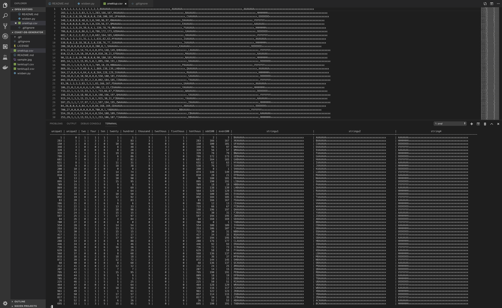
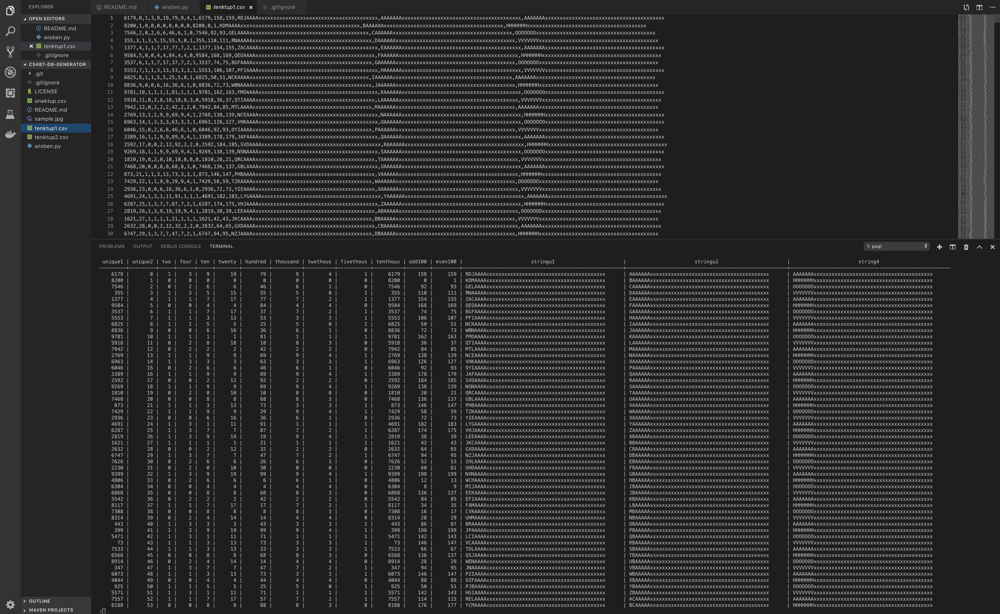
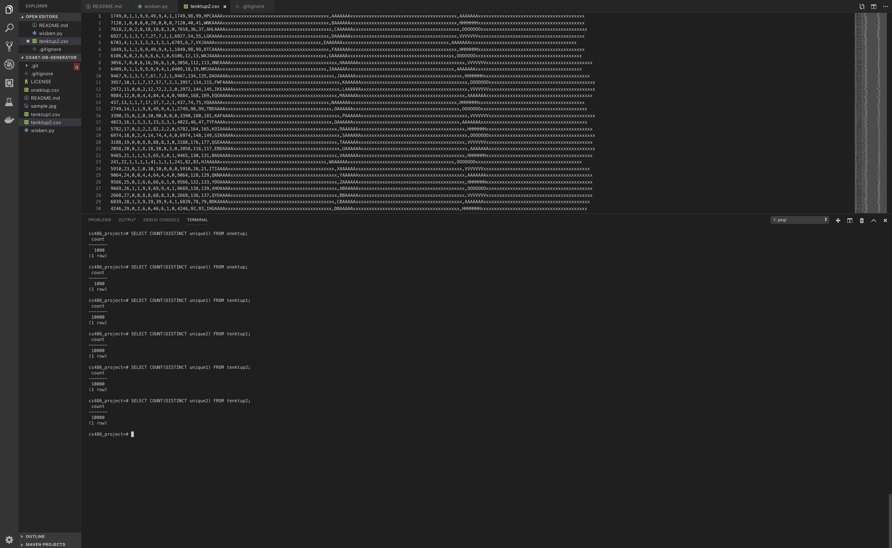

# CS487-DB-Generator
## DB generator implementation of Wisconsin Benchmark

Authors: Arron Wang & Brent Daniels-Soles

## Overview

Purpose of this document is have a reference of the steps taken to implement a program which produces a vaild Wisconsin Benchmark data set and give some insight into what the data looks like inside a database. For the initial upload of data, a Postrgres instance on a local machine was used. Once we start to benchmark, we will use the databases detailed in the 'Environment' section of this paper.

The following document uses Python as the programming language, and where applicable, will use psuedo-code with a syntax similar to Python.
___
## Implementation Notes

As stated in section 2.1.1 of the Wisconsin Benchmark paper, the original benchmark has three relations: ONEKTUP, TENKTUP1 and TENKTUP2. Their differences are as follows:

* ONEKTUP, means there are 1,000 tuples in a table (in this paper as onektup)
* TENKTUP1, TENKTUP2 have 10,000 respectively (in this paper as tenktup1 and tenktup2)

Where they each are the same is in the type of data that lives in the table, which is as follows:

* 13 integer attributes (where an integer is 4 bytes)
* 3 52-byte strings

We were able to fufill these requirments as you see later on the in the paper. Below are the details of the schema, as well as some screen shots of what the data looks like when input into the database.

___
## Databse Environments

We will use three different relational databases to conduct the performance comparisons. The databses we will be using are:

* MySQL
* Postgresql
* Cloud option of Google CloudSQL

MySQL and Postres were chosen because they are available for free (yay, open source!) and are quite popular for commercial applications. The MySQL and Postgres instances will be hosted on two different local machines with differing hardware and operating systems. The first machine is a Microsoft Surface Book and the second a Macbook Pro. Having these two systems, with two different operating systems will allow us to see which hardware/os is better able to run the database isntances.

In addition, we will be utilizing a cloud based solution, for the purposes of seeing what performance implicaitons a cloud provider may have, and give an idea of what queries will look like "in the real world". The main reason for choosing this system, is to see what query execution on a cloud provider looks like, and to see if there are any performance increases, as well as possible increases in developer experience in the process of development. In the cloud, Linux is the OS of choice, so we will be using Linux for the query interface for Google CloudSQL.

Our approach should highlight some of the differneces between local development and deployed database solutions. Our hypothesis is, in general the cloud solution will be more consistent with reads/writes than local instances of the databases. It will help us see how different local development is vs. non local, and see differences between some of the most popular open sources databases available. 

___
## Schema Definition

Note: This is copied directly from the Wisconsin Benchmark paper.

```sql
CREATE TABLE TUP
(
  unique1   integer NOT NULL,             # Random 0..9999
  unique2   integer NOT NULL PRIMARY KEY, # Random 0..9999
  two       integer NOT NULL,             # unique1 mod 2
  four      integer NOT NULL,             # unique1 mod 4
  ten       integer NOT NULL,             # Cunique1 mod 10
  twenty    integer NOT NULL,             # unique1 mod 20
  hundred   integer NOT NULL,             # unique1 mod 100
  thousand  integer NOT NULL,             # unique1 mod 1000
  twothous  integer NOT NULL,             # unique1 mod 2000
  fivethous integer NOT NULL,             # unique1 mod 5000
  tenthous  integer NOT NULL,             # unique1 mod 10000
  odd100    integer NOT NULL,             # hundred * 2
  even100   integer NOT NULL,             # hundred * 2 + 1
  stringu1  char(52) NOT NULL,            # See below
  stringu2  char(52) NOT NULL,            # ""
  string4   char(52) NOT NULL,            # cyclic
)
```

When creating each of the tables initially in Postgres, this is the schema that was used for each of three tables taht are needed: onektup, tenktup1, tenktup2.

One thing to note: the "scalable" version of the schema calls for an extra field 'unique3', which is the same value s unique1. In the future the schema will be updated to include this, and have the info more closely align with the "scalable" version. 

### Schema in Action

We used this schema provided to create each of the tables: onektup, tenktup1, tenktup3. Each of the tables were painless to implement, since they have the same structure. Once we had generated the data, we could copy the values generated from the csv's into the tables located in the database.

The following are some images of insered data from a .csv into each of the respective tables:

* onektup (One thousand tuples: in the repo as onektup.csv)

Note: the top image pane shows the output from the program, and the reflected values put into the database

* tenktup1 (Ten Thousand tuples: in the repo as tenktup1.csv)

Note: the top image pane shows the output from the program, and the reflected values put into the database

* tenktup2 (Ten Thousand tuples: in the repo as tenktup2.csv)

Note: the top image pane shows the output from the program, and the reflected values put into the database


For each of them, you can see there are unique values for both the unique columns, which is a requirement of the bench mark:


___
## Program Desgin

Requirements to run the program:
  1. python3 must be installed

That's it!

The program to generate the .csv data is a Python script invoked in the following ways:

1. `$> python3 wisben.py -t 1000 -f data.csv`

~ or ~

2. `$> ./wisben.py -t 1000 -f data.csv`

If the `./` method does not work, please make sure you are giving the script permissino to execute or try to pass the program to the python3 command line argument.

### Arguments

The program takes two argument: number of tuples and the filen name you would like for the data. You can pass each of the flages like so:

* `-f [filename]` or `--file [filename]`
* `-t [number of tuples`] or `--tuples [number of tuples]`

Each of these arguments is required, -f being a string and -t being an int.

### Time complexity

We have designed our program to have a runtime of `O(n)`, which means even on large data sets with 10000+ rows, the file specified in the command line arguments on a modern machine should be fairly quick. In a test, generating a file with 1,000,000 tuples took only a few seconds (still on the the best, but quick for python).

Some performance optimizations could be made, however, they are small and help with the readability of the code. These take the form of small `O(n)` loops.

### Nitty Gritty

As you will see by looking at the source code, our main chunck of computation is house in a for loop which iterates over the range specified in the `--tuples` argument provided to the program. Once the arguments have been parsed, they are passed to single function which calls the big for loop for generating each of the tuples. Once the tuples have been loaded up into a buffer (an array in this case), we open the specified file (creating it, if it doesn't exist), and then proceed to write out each index in the array to a corresponding line the file.

In order to write out to a file, the standard library function `open()` is used, which we pass a `w+` flag to indicate we would like to write into the file, creating it if it does not exists (and if it exists, it will overwrite the current file). 

One nuance of the program, is it generates a random table of data each time it is run. What this means, is if I run the program 3 times, for the same number of tuples, the results will be different each time. In the long run, this may impact performance of queries.

